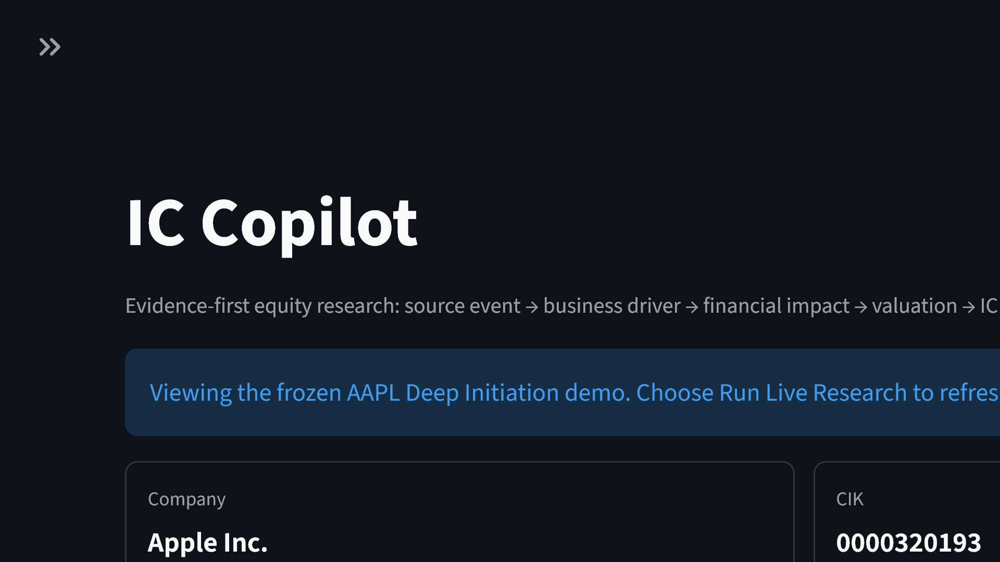
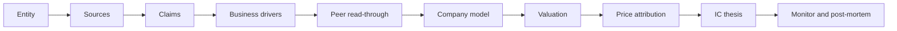

# IC Copilot

**Turn filings, calls, peer metrics, and market reactions into a citation-bound investment thesis that can also say: no convincing thesis yet.**

[](https://ic-copilot.streamlit.app/)
[](https://github.com/mwsp-code/IC-Copilot/actions/workflows/tests.yml)
[](LICENSE)
[](https://www.python.org/)

[Try the live demo](https://ic-copilot.streamlit.app/) | [Quickstart](docs/quickstart.md) | [Methodology](docs/methodology.md) | [Roadmap](ROADMAP.md) | [Contribute](CONTRIBUTING.md)



## Why IC Copilot

Most AI research tools are good at producing text. IC Copilot is designed to produce an **auditable investment decision trail**:

- **Exact evidence:** filing section, period, metric, unit, source tier, URL, and parser status.
- **Causal reasoning:** source event -> business driver -> KPI -> earnings/FCF -> valuation -> catalyst.
- **Adversarial review:** Bull, Bear, and Judge views with unresolved contradictions kept visible.
- **Market-implied expectations:** reverse DCF and implied operating assumptions when historical consensus is unavailable.
- **A real ability to say no:** boilerplate, stale facts, unmapped drivers, and unsupported LLM claims do not become high-conviction ideas.

The app is built for equity analysts, credit analysts, portfolio managers, and AI builders who want evidence before eloquence.

## See It In 60 Seconds

1. Open the [hosted app](https://ic-copilot.streamlit.app/). The AAPL Deep Initiation demo is loaded automatically.
2. Read the one-screen IC Story: verdict, what changed, causal bridge, counter-thesis, valuation, and next action.
3. Open an evidence drawer to inspect the exact citation and formula trace.
4. Switch to NVDA, BABA, TSLA, or GS to see a different research playbook.

The frozen demos require no API keys, make no paid provider calls, and contain no licensed full-text payloads.

## The Workflow



Every connection is scored separately. A weak link identifies the exact missing evidence instead of turning into generic uncertainty.

## Demo Gallery

| Demo | Research lesson |
|---|---|
| **AAPL** | Source-backed cash-flow and margin thesis with model-derived scenarios |
| **NVDA** | Neutral-first capex and goodwill investigation with semiconductor peer checks |
| **BABA** | ADR/FPI normalization, China segments, bilingual external context, and price-only capture |
| **TSLA** | Driver-specific peer metric read-through across automakers |
| **GS** | Bank/broker economics, equity lens, and credit lens |
| **SPCX** | Entity-resolution guardrail that stops unreliable analysis early |

## Quickstart

### Streamlit

```bash
git clone https://github.com/mwsp-code/IC-Copilot.git
cd IC-Copilot
python -m pip install -r requirements.txt
streamlit run app.py
```

### No-dependency local UI

```bash
python server.py --port 8501
```

The lightweight server automatically tries ports through `8510` when `8501` is occupied.

### Editable install for contributors

```bash
python -m pip install -e ".[dev]"
pytest -q
```

### Docker

```bash
docker build -t ic-copilot .
docker run --rm -p 8501:8501 ic-copilot
```

## Research Profiles

- **Fast Screening:** 4 quarters, 2 annual reports, 4 calls, and the highest-ranked anomaly.
- **Adaptive IC Research:** default; 12 quarters, 4 annual reports, 12 calls, and five material changes.
- **Deep Initiation:** 20 quarters, 5 annual reports, 20 calls, and deeper contradiction work.
- **Investigate This Event:** a filing-, call-, metric-, or news-scoped workflow.

Ambiguous changes are neutral first. Constructive and adverse explanations are investigated side by side before direction is assigned.

## Data and LLM Policy

SEC and issuer evidence remain the backbone. Official macro, market data, paid providers, Wisburg, and news can deepen context, but source tiers and licensing policies remain visible.

LLMs may plan registered sources, triage documents, draft structured extractions, compare evidence, and write an IC narrative. They cannot invent citations, targets, calibrated probabilities, or promotion decisions. Deterministic validation remains authoritative.

API keys are optional for the demos. For live work, save credentials through the OS keychain, environment variables, or Streamlit secrets. Never commit keys or licensed payloads. See [Provider Configuration](docs/providers.md).

## Research Integrity Benchmark

The repository ships a no-network benchmark over 25 research-integrity cases across AAPL, NVDA, BABA, TSLA, and GS. It checks event grounding, thesis grounding, counter-thesis handling, monitor/payoff readiness, and promotion integrity.

```bash
python scripts/run_benchmark.py
```

This is an integrity benchmark, not a claim of investment performance. See [Benchmark Methodology](benchmarks/README.md).

## Architecture

IC Copilot separates deterministic evidence collection from hypothesis generation, valuation, monitoring, and optional LLM synthesis. Provider failures are isolated, normalized, and source-labelled; missing values remain `Unknown` rather than becoming zero.

See [Architecture](docs/architecture.md) and [Research Methodology](docs/methodology.md).

## Contributing

Useful first contributions include:

- Add a sector KPI playbook.
- Add an ADR/FPI profile.
- Add a canonical metric alias.
- Add a registered source adapter.
- Add a sanitized demo or benchmark case.

The UI and docs contain explicit contributor paths. Read [CONTRIBUTING.md](CONTRIBUTING.md), browse issues labelled `good first issue`, or start a design question in GitHub Discussions after it is enabled.

## Project Status

IC Copilot is research software under active development. It does not execute trades and does not provide financial advice. Frozen demos illustrate methodology; refresh live sources before using any observation in an investment process.

See [Roadmap](ROADMAP.md), [Security Policy](SECURITY.md), and [Changelog](CHANGELOG.md).

If IC Copilot improves how you think about evidence, consider starring the repository and sharing the benchmark with another analyst or builder.
