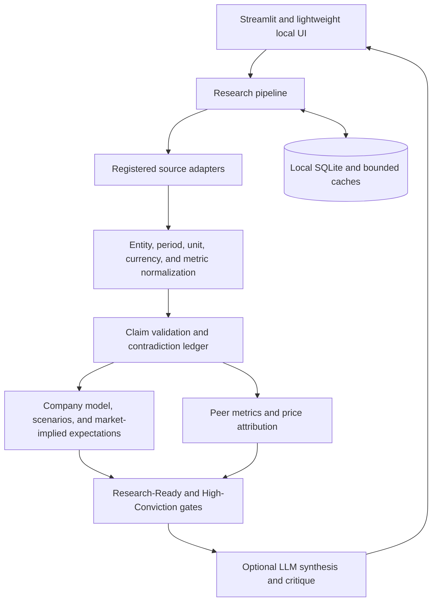

# Architecture

IC Copilot keeps evidence collection and decision synthesis separate so a fluent narrative cannot overwrite a weak factual record.

## Core boundaries

### Deterministic evidence

- SEC submissions, filings, exhibits, and XBRL facts.
- Issuer releases, presentations, and registered transcript sources.
- Point-in-time prices, consensus snapshots, macro releases, and peer observations.
- Canonical entity, metric, period, unit, currency, and ADR normalization.

### Research interpretation

- Neutral-first anomaly assessment.
- Constructive and adverse causal hypotheses.
- Evidence closure against registered source requirements.
- Company-model, scenario, valuation, credit, and market-implied bridges.

### Optional LLM contribution

- Registered-source planning.
- Document and table triage.
- Citation-bound extraction drafts.
- Trend summary, thesis synthesis, and secondary critique.

LLM output is provisional until deterministic checks validate identity, period, scope, citation, unit, currency, and source eligibility.

## Extension points

| Extension | Primary location | Required contract |
|---|---|---|
| Sector playbook | `data/sector_kpi_playbooks.csv` | Material KPIs, drivers, confirmation and falsification rules |
| Industry playbook | `data/industry_playbooks.csv` | Business economics, catalysts, valuation methods, peer logic |
| ADR/FPI profile | `data/adr_profiles.csv` | Ratio, currency, forms, home exchange, issuer sources |
| Metric alias | `data/metric_ontology.csv` | Canonical metric, source tag, derivation and confidence |
| Peer universe | `data/peer_universes.csv` | Curated peers, rationale, effective date, sector template |
| Source adapter | `equity_research/` | Provider health, timestamps, source tier, citation and licensing policy |
| Demo case | `equity_research/storytelling.py` and `sample_data.py` | Sanitized no-network fixture and regression tests |

## Storage

SQLite stores normalized observations, manifests, idea versions, evidence, monitor rules, outcomes, and provider health. Full licensed vendor payloads are not retained by default. API keys are never written to SQLite.

## Failure policy

Provider failures are independent and non-blocking. The app distinguishes missing keys, entitlement errors, timeouts, blocked networks, malformed payloads, stale periods, missing metrics, and unsupported securities. A failed secondary provider cannot erase valid SEC or issuer evidence.

